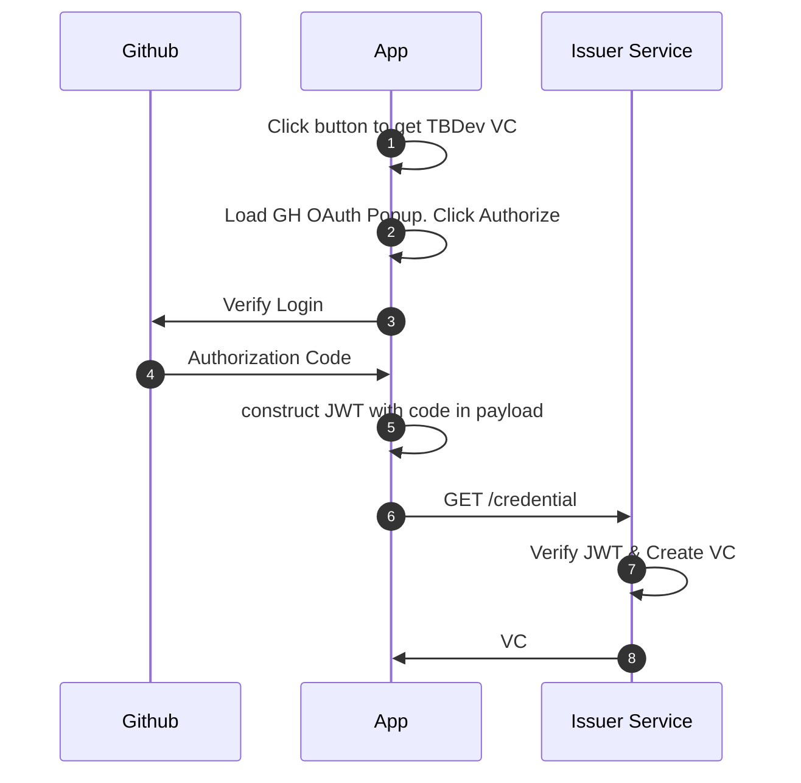

# TBDeveloper Credential Issuer <!-- omit in toc -->
Service that issues a TBDeveloper Verifiable Credential using [Github OAuth](https://docs.github.com/en/apps/oauth-apps/building-oauth-apps/authorizing-oauth-apps) for identity verification

- [How it works](#how-it-works)
- [Development Prerequisites](#development-prerequisites)
  - [`node` and `npm`](#node-and-npm)
  - [VSCode](#vscode)
- [Running the Project](#running-the-project)
  - [Running Locally](#running-locally)
  - [Tests](#tests)
    - [Running Unit Tests](#running-unit-tests)
- [Configuration](#configuration)
- [Helpful References](#helpful-references)


# How it works



[Example Credential](https://jwt.io/#debugger-io?token=eyJhbGciOiJFZERTQSIsInR5cCI6IkpXVCIsImtpZCI6ImRpZDpkaHQ6dHNtYWRyN3E3N3pwdHA2ZnRqb2twOHRoMXp5ZGFmbzVwczY4ZXk3a3A4cGlwb3E1Y250eSMwIn0.eyJpc3MiOiJkaWQ6ZGh0OnRzbWFkcjdxNzd6cHRwNmZ0am9rcDh0aDF6eWRhZm81cHM2OGV5N2twOHBpcG9xNWNudHkiLCJzdWIiOiJkaWQ6a2V5Ono2TWtwRDROclU5SEFSdWJXc2hrUERESHJnWlBpQ3ZKbmVtRFZnU2g0SFVzYnhqeSIsInZjIjp7IkBjb250ZXh0IjpbImh0dHBzOi8vd3d3LnczLm9yZy8yMDE4L2NyZWRlbnRpYWxzL3YxIl0sInR5cGUiOlsiVmVyaWZpYWJsZUNyZWRlbnRpYWwiLCJUQkRldmVsb3BlckNyZWRlbnRpYWwiXSwiaWQiOiJ1cm46dXVpZDo2YzhiYTNhNy04ZjRlLTQ2YmMtYmU0NC0zYjljN2YxYzE3OTgiLCJpc3N1ZXIiOiJkaWQ6ZGh0OnRzbWFkcjdxNzd6cHRwNmZ0am9rcDh0aDF6eWRhZm81cHM2OGV5N2twOHBpcG9xNWNudHkiLCJpc3N1YW5jZURhdGUiOiIyMDIzLTExLTE5VDAxOjMzOjU4WiIsImNyZWRlbnRpYWxTdWJqZWN0Ijp7ImlkIjoiZGlkOmtleTp6Nk1rcEQ0TnJVOUhBUnViV3Noa1BEREhyZ1pQaUN2Sm5lbURWZ1NoNEhVc2J4ankiLCJ1c2VybmFtZSI6Im1pc3Rlcm1vZSJ9fX0.fiMGpDda_UDvygMBqdn_VcSrsGV97ZziU2o08W9HKU7nq6DTmtxi8dW6kYsxELHM4AERclOYD-shi6xvQdWWDw)

> [!NOTE]
> jwt.io will say "Invalid Credential" because it doesn't support `ES256K` or `EdDSA:Ed25519` signatures


# Development Prerequisites
## `node` and `npm`
This project is using a minimum of `node v20.3.0` and `npm v9.6.7`. You can verify your `node` and `npm` installation via the terminal:

```
$ node --version
v20.3.0
$ npm --version
9.6.7
```

If you don't have `node` installed. Feel free to choose whichever approach you feel the most comfortable with. If you don't have a preferred installation method, i'd recommend using `nvm` (aka node version manager). `nvm` allows you to install and use different versions of node. It can be installed by running `brew install nvm` (assuming that you have homebrew)

Once you have installed `nvm`, install the desired node version with `nvm install vX.Y.Z`.

## VSCode
[VSCode](https://code.visualstudio.com/) is a lightweight open-source code editor that comes with a bunch of helpful extensions for javascript/typescript projects. Using VSCode is definitely not required.

If you do choose to use VSCode, opening this project will automatically prompt you to install helpful extensions and pre-configure your workspace with a bunch of fancy thangs (e.g. autoformat on save.)

# Running the Project
> [!IMPORTANT]
> Make sure you have all the [prerequisites](#development-prerequisites)

1. Install all project dependencies by running `npm install`
2. Start the server by running `npm run server`

> [!NOTE]
> 💡 Check the [configuration](#configuration) section of this README for a list of all possible environment variables, a description of each, and their respective defaults (if any)

## Running Locally
the service can be run locally using `npm run server`

## Tests
### Running Unit Tests
Tests in `./tests/` can be run using `npm run test`

# Configuration
Configuration can be set using environment variables. Defaults are set in `src/config.ts`

| Env Var                  | Description                                        | Default            |
| ------------------------ | -------------------------------------------------- | ------------------ |
| `LOG_LEVEL`              | Possible values: `debug`, `info`, `warn`, `error`. | `info`             |
| `HOST`                   | Where the application is hosted                    | `http://localhost` |
| `PORT`                   | Application port                                   | `9000`             |
| `GH_OAUTH_CLIENT_ID`     | Client ID for OAuth Application                    | N/A                |
| `GH_OAUTH_CLIENT_SECRET` | Client Secret for OAuth Application                | N/A                |


# Helpful References
* [Typescript Handbook](https://www.typescriptlang.org/docs/handbook/intro.html)
* [Typescript Playground](https://www.typescriptlang.org/play)
* [Typescript cheatsheets](https://www.typescriptlang.org/cheatsheets)
